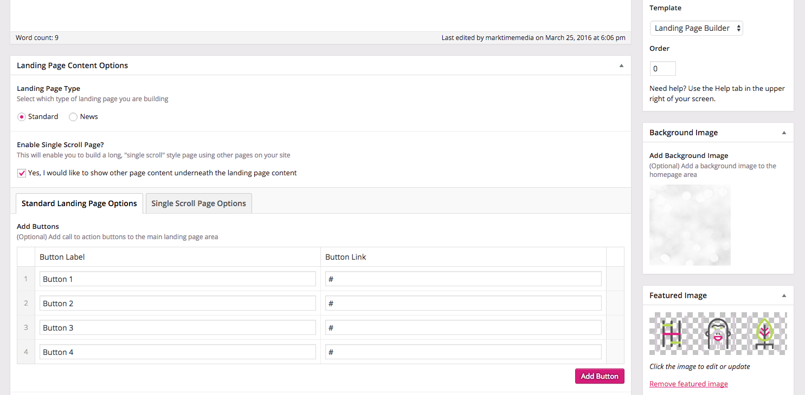
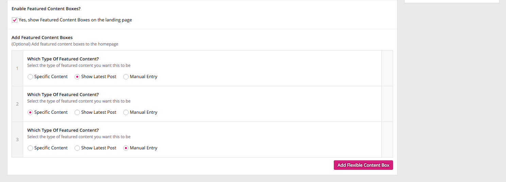
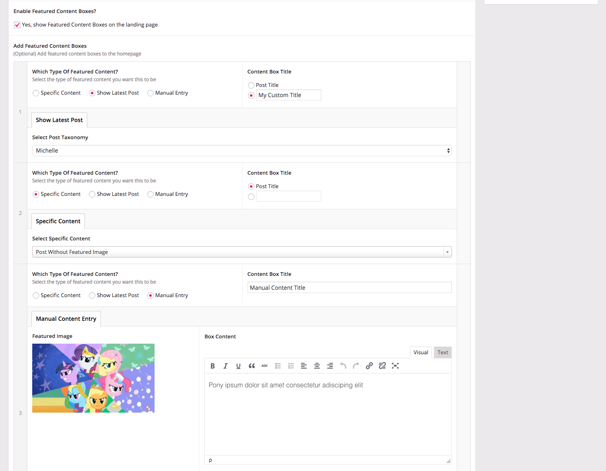
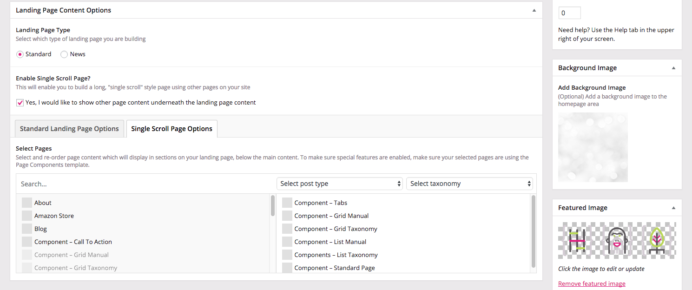
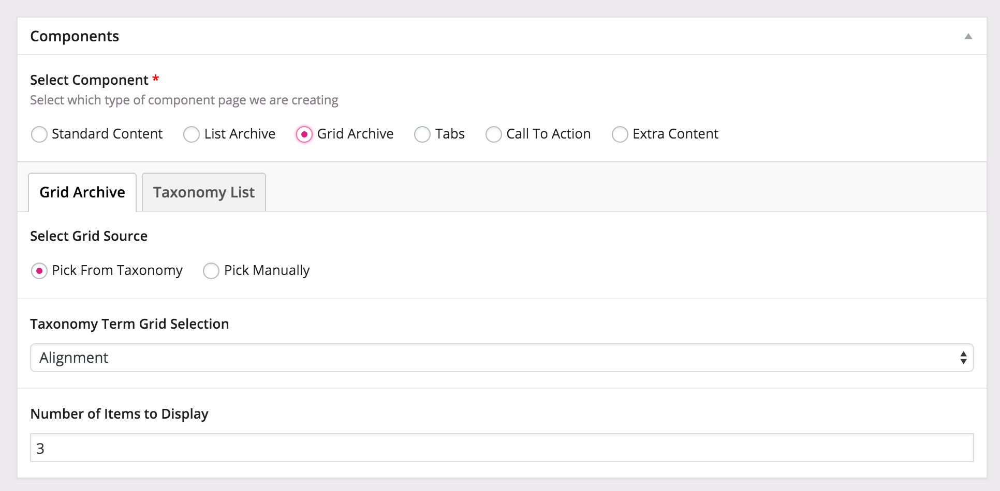
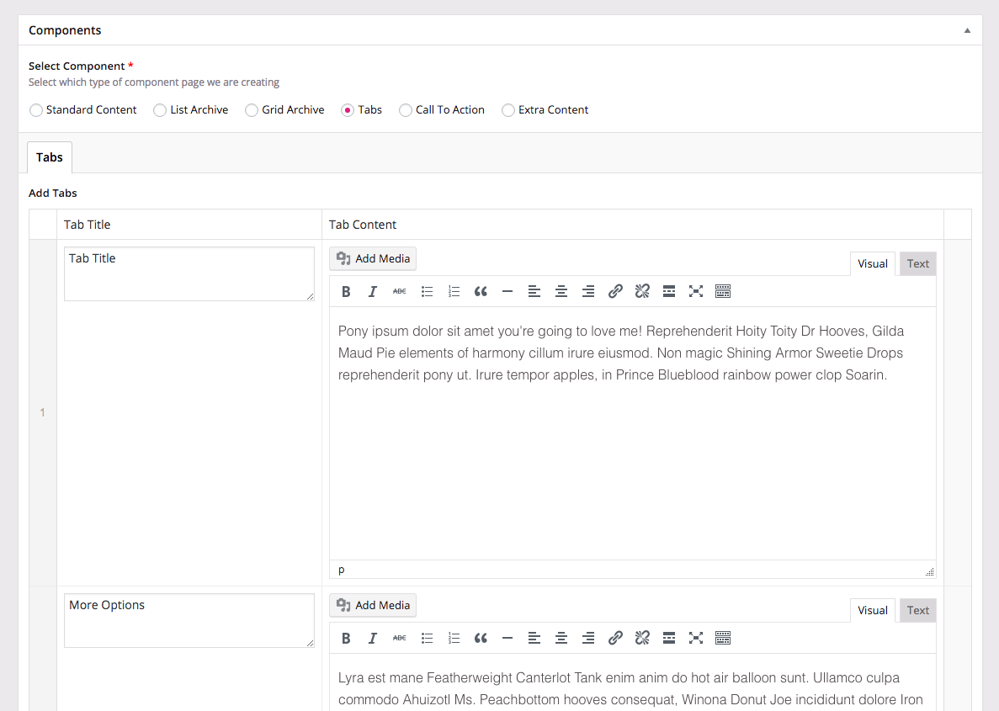
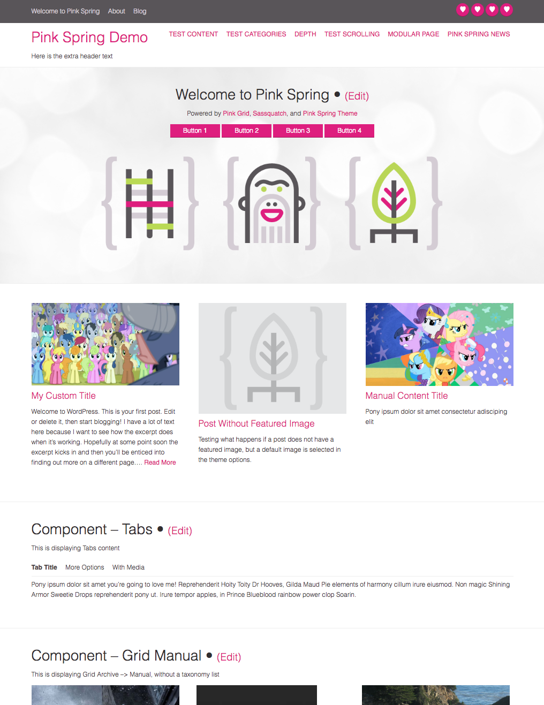

#ACF Page Components For WordPress

Page builder plugin for WordPress that adds custom page templates to your theme for displaying custom content types and building single-scroll multipages. **Requires [Advanced Custom Fields Pro](http://advancedcustomfields.com/pro) and [ACF Term and Taxonomy Chooser](https://github.com/marktimemedia/acf-term-and-taxonomy-chooser)**.

Works with most standard WordPress themes, including Roots/Sage based themes with no theme wrapper.

### New Content Fields

##### Page Components
1. Standard Content (nothing added)
2. List Archive – displays either a manually curated list of items, or a list of the most recent from a specific taxonomy
3. Grid Archive – displays either a manually curated grid of items, or a grid of the most recent items from a specific taxonomy
4. Tabs – displays title and tab fields
5. Call to Action – displays a custom CTA button
6. Extra Content – displays extra WYSIWYG editor content

##### Home Page Builder
1. Buttons – Add a row of call to action buttons
2. Background Image – Add a full sized background image
3. Feature Boxes – Custom feature boxes of manual or selected post content
4. Single Scroll Page – Build a long page out of multiple Page Component pages to create a unique site

### Vague Description of How To Use
1. Install and activate the plugin
2. On Pages, select the Page Template called "Page Components" in order to use the extra field groups
3. On your front page, or any page with single-scroll/multi-page capabilities, select the Page Template called "Home Page Builder" to enable the special home page functionality (like buttons and feature boxes) and single-scroll page builder.

### Vague Description of How To Theme
1. Create a folder called `mtm-templates` in the root of your theme or child theme
2. Copy any of the template parts in the plugin `templates` folder into your `mtm-templates` folder, and modify/style them at will. The plugin will automatically override them.
3. To call any of the custom template parts from another part of your theme, use the `mtm_get_template_part()` function

### Screenshots

##### Homepage Builder Field Samples

##### Page Component Field Samples

##### Theme Demo

In use with [Pink Spring Theme](https://github.com/marktimemedia/pink-spring)

